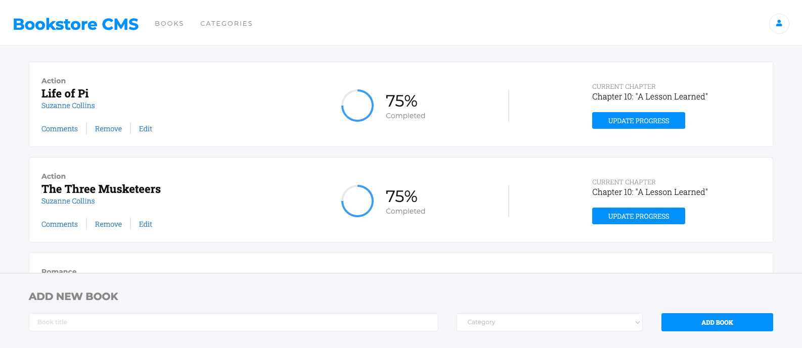

# Bookstore

> This project is about a bookstore.

## Built With

- React, Redux, HTML & CSS & JS

## Project Setup

- Clone this repository (use this SSH key git@github.com:sevinchek/bookstore.git)
- Open the folder project (bookstore)
- Install all dependencies with "npm install"
- Run the project with "npm start" and the project will load automatically in your default browser

## Authors

👤 **Kevin**

- GitHub: [@sevinchek](https://github.com/sevinchek)
- Twitter: [@sevinchek](https://twitter.com/sevinchek)
- LinkedIn: [LinkedIn](https://linkedin.com/in/sevinchek)

## 🤝 Contributing

Contributions, issues, and feature requests are welcome!

## Show your support

Give a ⭐️ if you like this project
